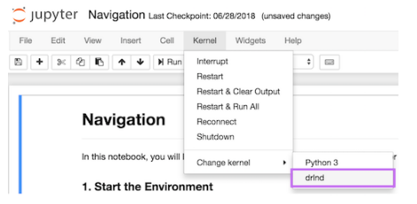

# Project 1: Navigation

### Introduction

In this project, you will learn to train an agent to navigate (and collect bananas!) in a large, square world.  


A reward of +1 is provided for collecting a yellow banana, and a reward of -1 is provided for collecting a blue banana.  Thus, the goal of your agent is to collect as many yellow bananas as possible while avoiding blue bananas.  

The state space has 37 dimensions and contains the agent's velocity, along with ray-based perception of objects around agent's forward direction.  Given this information, the agent has to learn how to best select actions.  Four discrete actions are available, corresponding to:
- **`0`** - move forward.
- **`1`** - move backward.
- **`2`** - turn left.
- **`3`** - turn right.

The task is episodic, and in order to solve the environment, your agent must get an average score of +13 over 100 consecutive episodes.

### Getting Started

1. Download the environment from one of the links below.  You need only select the environment that matches your operating system:
    - Linux: [click here](https://s3-us-west-1.amazonaws.com/udacity-drlnd/P1/Banana/Banana_Linux.zip)
    - Mac OSX: [click here](https://s3-us-west-1.amazonaws.com/udacity-drlnd/P1/Banana/Banana.app.zip)
    - Windows (32-bit): [click here](https://s3-us-west-1.amazonaws.com/udacity-drlnd/P1/Banana/Banana_Windows_x86.zip)
    - Windows (64-bit): [click here](https://s3-us-west-1.amazonaws.com/udacity-drlnd/P1/Banana/Banana_Windows_x86_64.zip)

    (_For Windows users_) Check out [this link](https://support.microsoft.com/en-us/help/827218/how-to-determine-whether-a-computer-is-running-a-32-bit-version-or-64) if you need help with determining if your computer is running a 32-bit version or 64-bit version of the Windows operating system.

    (_For AWS_) If you'd like to train the agent on AWS (and have not [enabled a virtual screen](https://github.com/Unity-Technologies/ml-agents/blob/master/docs/Training-on-Amazon-Web-Service.md)), then please use [this link](https://s3-us-west-1.amazonaws.com/udacity-drlnd/P1/Banana/Banana_Linux_NoVis.zip) to obtain the environment.

2. Place the file in the DRLND GitHub repository, in the `p1_navigation/` folder, and unzip (or decompress) the file.

### Instructions

Follow the instructions in `Navigation.ipynb` to get started with training your own agent!  

## Dependencies

This project was a part of Deep Reinforcement Learning Nanodegree by Udacity and requires some dependecies from the original [git repo](https://github.com/udacity/deep-reinforcement-learning) of deep reinforcement learning. So we'll need to install dependencies from it to support Unity ML Agents and required kernel.<br>
To set up your python environment to run the code in this repository, follow the instructions below.

1. Create (and activate) a new environment with Python 3.6.

	- __Linux__ or __Mac__:
	```bash
	conda create --name drlnd python=3.6
	source activate drlnd
	```
	- __Windows__:
	```bash
	conda create --name drlnd python=3.6
	activate drlnd
	```

2. Clone the repository (if you haven't already!), and navigate to the `python/` folder.  Then, install several dependencies.
```bash
git clone https://github.com/udacity/deep-reinforcement-learning.git
cd deep-reinforcement-learning/python
pip install .
```

3. Create an [IPython kernel](http://ipython.readthedocs.io/en/stable/install/kernel_install.html) for the `drlnd` environment.  
```bash
python -m ipykernel install --user --name drlnd --display-name "drlnd"
```

4. Activate the `conda` environment
```bash
conda activate drlnd
```

5. Run `jupyter notebook`  in this environment
```
jupyter notebook
```

6. Navigate to the `Navigation.ipynb` file and open it. Before running code in a notebook, change the kernel to match the `drlnd` environment by using the drop-down `Kernel` menu.



### Conclusion
Finally a `pytorch` checkpoint will be saved as `checkpoint.pth` which can be later loaded and used to solve the banana navigation problem.
