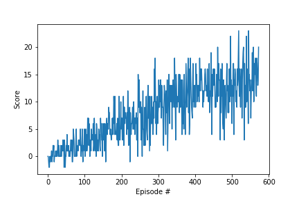

# Project 1: Navigation

### Introduction

In this project, you will learn to train an agent to navigate (and collect bananas!) in a large, square world.  


For this project, I used the same `Deep Q-Network(DQN)` implementation setup that was used to solve `Lunarlander` problem in previous unit. After playing out with the layers and different units values for the `Q_network` model, I got decent results solving the puzzle in 573 episodes.

## Learning Algorithm
For the purpose of solving this project, the starting point was to seek help from the previous `DQN network` learned during this course. And the the first thing in mind was to make the network deeper, that is more layers, but that didn't go as expected as I first considered large number of units. So, I dropped the layer to its original two and used same 64 units for first hidden layer but 128 hidden units for second layer. The primary reason was for Lunarlander there were only 8 state size but this problem had 37 states.
```
Input(37)->HiddenLayer1(64)->HiddenLayer2(128)->Output(4)
```
### Hyperparameters
The Hyperparameters used are the same used in DQN:
```python
BUFFER_SIZE = int(1e5)  # replay buffer size
BATCH_SIZE = 64         # minibatch size
GAMMA = 0.99            # discount factor
TAU = 1e-3              # for soft update of target parameters
LR = 5e-4               # learning rate
```
## Plot of Rewards
The graph below shows average rewards over the period of 100 episodes. The DQN network was able to attain 13.0+ average rewards at only just 573 episodes.


## Ideas for Future Work
The only approach used here was DQN approach but as an ideas for future work, we could try other improvements suggested in the previous unit. We could try Double DQN, Prioritized Experience Replay(seems more promising) and Dueling DQN or we could even move to Rainbow approach. But may be we could try to play with more Hyperparameters and achieve better results with current network and move to PER approach.  
