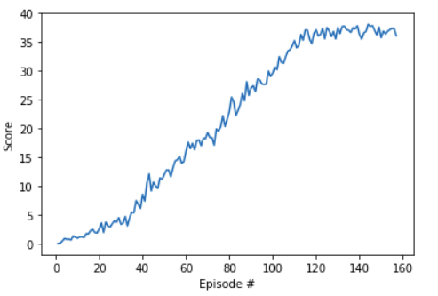

# Project 2: Continuous Control

### Introduction

In this project, you will learn to train agents in Reacher environment.   


## Learning Algorithm
For this project, I used the same `DDPG` algorithm which was developed by team at Google Deepmind and published at ICLR 2016 under the name [`CONTINUOUS CONTROL WITH DEEP REINFORCEMENT LEARNING`](https://arxiv.org/pdf/1509.02971.pdf).
**Deep Deterministic Policy Gradient (DDPG)** is a model-free off-policy algorithm for learning continous actions. This algorithm combines Deterministic Policy Gradient(DPG) which mainly operates over continous action space and Deep Q-Network(DQN) which uses Experience Replay and slow learning target networks.

This algorithm combines the actor-critic approach along with the insight of DQN. The algorithm uses two target networks and these networks are updated slowly to keep estimated targets stable. It also uses Experience Replay to store Experiences and later learn from it.

To ensure better exploration by Actor network in continous action spaces, a noise sampled from a noise process
 to actor policy.

<br/>
As discussed in the paper `Ornstein-Uhlenbeck process` for generating noise which samples noises from a correlated `normal` distribution.

In this implementation, instead of updating the actor and critic networks 20 times at every timestep, networks were updated 10 times after every 20 timesteps.

### Model Architecture
The model has two networks.
1. **Actor:**<br/>
    It proposes an action for a given state.<br/>
    The Actor model is a neural network with 2 hidden layers with size of 400 and 300. `tanh` activation is used in the final layer to limit the action values within limit of -1 and 1. Batch normalization is used on the state input and all layers as suggested in supplementary material of the original paper to scale features so that they are in similar ranges across environments and units.
2. **Critic:**<br/>
    It predicts if action is good or bad given a sate and an action. The critic model is similar to that of actor model but `tanh` is not used in final layer and actions were included in the second hidden layer. And Batch normalization was used in a layer that was prior to the action input.

### Hyperparameters
The Hyperparameters used are the same used in this implementaion are:
```python
BUFFER_SIZE = int(1e6)  # replay buffer size
BATCH_SIZE = 128        # minibatch size
GAMMA = 0.99            # discount factor
TAU = 1e-3              # for soft update of target parameters
LR_ACTOR = 1e-3         # learning rate of the actor
LR_CRITIC = 1e-3        # learning rate of the critic
WEIGHT_DECAY = 0        # L2 weight decay
UPDATE_EVERY = 20       # how often to update the network
N_UPDATES = 10          # how many times to update the netwok
```
## Plot of Rewards
The graph below shows average rewards over the period of 100 episodes. The DDPG network was able to attain 30.0+ average rewards at only just 157 episodes.


## Ideas for Future Work
This problem is one of the hardes to tune. So, some addition to this approach or even other algorithms may help to attain better and uniform results. One of the changes can be adding `Prioritized Experience Replay(PER)` instead of `Experience Replay` only. Here since we have 1 million buffer size and we are considering 128 samples per batch so if we could get relevant experiences at each sample, the model's performance may highly improve and be less sensitive to change in Hyperparameters as it is now. We could also explore other Actor-critic methods like PPO and A3C. 
