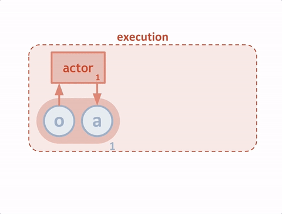
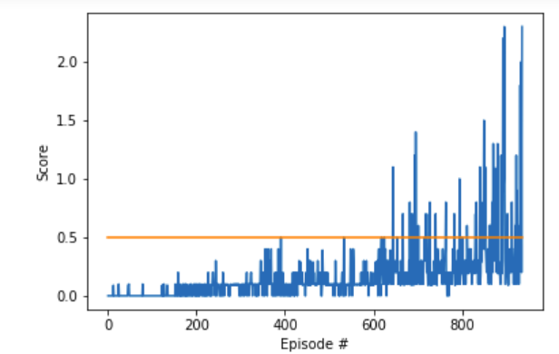

# Project 3: Collaboration and Competition

### Introduction

In this project, you will learn to train two agents in table tennis environment.   


## Learning Algorithm
For this project, I used the same `MADDPG` algorithm developed by OpenAI in 2017 and published  under the name [Multi-Agent Actor-Critic for Mixed Cooperative-Competitive Environments](https://arxiv.org/pdf/1706.02275.pdf).

**Multi-Agent Deep Deterministic Policy Gradient (DDPG):**<br/>
The given table tennis environment consists of two agents. These two agents are opponents and they might need to compete against each other in certain conditions such as gathering as much points as possible and they might need to collaborate with each other in certain conditions like not letting the ball hit the ground. And unfortunately, the traditional reinforcement learning approaches such as Q-Learning and policy gradient approaches doesn't work well in these conditions. This is mainly because each agent's policy is changing as training progresses and the environment becomes non-stationary from the perspective of any individual agent. And this leads to learning stability problem and straightforward use of experiences replay for Q-learning approaches. And additional, the variance problem is highly significant as the number of collaborating agent increases.

The above paper suggests a framework of centralized training with decentralized execution by allowing the policies to use extra information to ease training but doesn't use the information during testing. It is difficult to do this with Q-Learning approaches with out making much more assumptions. So, a simple extension of actor-critic policy gradient method is suggested as it requires minimum changes. Here the critic has full access to the policy and observations of other agents as well during training while the critic has access to the local information only.And after the training  is completed, the local actors are only used at execution phase acting in decentralized manner. The process is shown in the following gif.

**Figure:** Overview of our multi-agent decentralized actor, centralized critic approach <br/>
**Source:** [Learning to Cooperate, Compete, and Communicate](https://openai.com/blog/learning-to-cooperate-compete-and-communicate/)

### Model Architecture
The main network behind the MADDPG is actor-critic network as well. MADDPG uses exactly `n` number of DDPG agents where n is the number of agents in the environment. In our case, its two. And each DDPG agent has two actor networks and two critic networks(local and critic).
The model has two networks.
1. **Actor:**<br/>
    The actor implementation is same as that in DDPG.
    The Actor model is a neural network with 2 hidden layers with size of 400 and 300. `tanh` activation is used in the final layer to limit the action values within limit of -1 and 1. Batch normalization is used on the state input and all layers as suggested in supplementary material of the original paper to scale features so that they are in similar ranges across environments and units.
2. **Critic:**<br/>
    The structure of critic is quite different than the critic used in DDPG. Different in the sense, the action size and state size of critic is not similar to that of actor. For the sake of **centralized** training, the state size for critic is the states of the both agents and the action size is that of both agents. Rest of the critic model is similar to that of actor model but `tanh` is not used in final layer and actions were included in the second hidden layer. And Batch normalization was used in a layer that was prior to the action input.

### Hyperparameters
The Hyperparameters used are the same used in this implementaion are:
```python
BUFFER_SIZE = int(1e6)  # replay buffer size
BATCH_SIZE = 128        # minibatch size
GAMMA = 0.99            # discount factor
TAU = 0.02              # for soft update of target parameters
LR_ACTOR = 1e-4         # learning rate of the actor
LR_CRITIC = 3e-4        # learning rate of the critic
WEIGHT_DECAY = 1.e-5        # L2 weight decay
UPDATE_EVERY = 1       # how often to update the network
```
## Plot of Rewards
The graph below shows average rewards over the period of 100 consecutive pisodes, after taking the maximum over both agents. The MADDPG network was able to attain 0.5+ average rewards at only just 935 episodes.


## Ideas for Future Work
Apart from MADDPG method, things that could be tried is using plain DDPG without centralized training and observe the results or other things that could be done is ensemble of other RL approaches. Some of the things that could be promising is MAPPO. And as always prioritized experiences replay(PER) or Hindsight Experience Replay might also help to improve the results. And experimenting with other agents like D4PG, PPO, TD3 and others might also give promising results.
